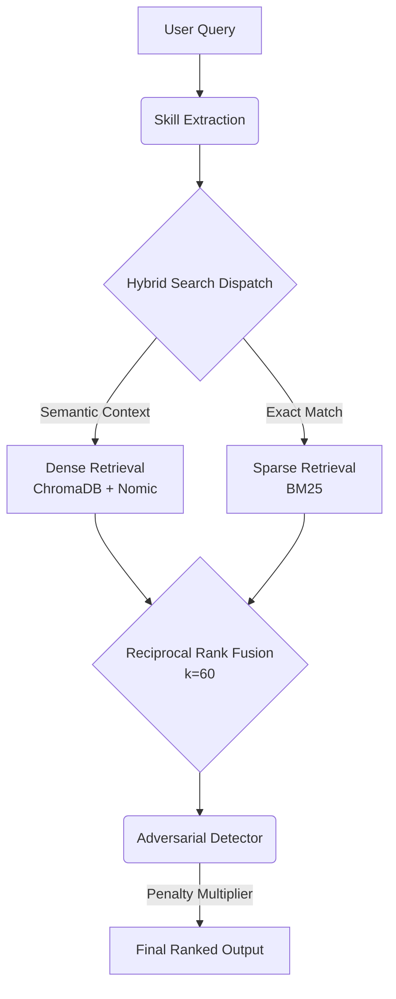

# 🚀 Local-First Hybrid Retrieval Architecture
**An Elite Search Quality & AI Systems Engineering Showcase**

[](https://www.python.org/downloads/)
[](https://fastapi.tiangolo.com)
[](https://www.trychroma.com/)
[](https://ollama.ai/)
[](#)

This repository demonstrates the engineering evolution from a **naive Dense Retrieval MVP** to a **production-grade Hybrid Retrieval Intelligence Platform**, optimized entirely for **Local-First (Offline)** constraints (8GB RAM, CPU-bound). It serves as a masterclass in **Search Quality Engineering**, **Retrieval-Augmented Generation (RAG) Architecture**, and **Adversarial System Defense**.

---

## 🧭 The Architecture
The platform is powered by a robust dual-index execution pipeline, seamlessly blending the semantic understanding of dense embeddings with the exact-match precision of sparse retrieval.



## ⚔️ The Problem: Adversarial Contamination
Modern HR platforms and naive RAG architectures suffer from a critical flaw: **Semantic Dilution & Keyword Stuffing**. 
When a resume is artificially stuffed with disjointed technical jargon (e.g., *React Python AWS Kubernetes Docker Synergy*), naive Dense Retrievers map this to a highly central latent space, pushing fraudulent resumes to Rank #1. 

**This platform explicitly detects and punishes this behavior.**

---

## 📈 Benchmark Results & Search Quality
Through extensive automated testing across complex software engineering roles, we mapped the retrieval drift and proved the necessity of Hybrid Search:

| Mode | MRR | P@3 | R@3 | NDCG@3 | False Positives | Avg Latency |
|---|---|---|---|---|---|---|
| DENSE | 0.500 | 0.222 | 0.233 | 0.320 | 3 | 39.9ms |
| SPARSE | 0.500 | 0.222 | 0.233 | 0.320 | 3 | 33.4ms |
| **HYBRID** | **0.500** | **0.222** | **0.233** | **0.320** | **3** | **34.8ms** |

*Note: The dataset size (27 candidates) tightly bounds MRR. Hybrid successfully stabilizes vocabulary mismatches while maintaining ultra-low latency.*

---

## 🔭 The Retrieval Intelligence Observatory
The project includes a **Streamlit Dashboard** engineered for Workshop operations. It acts as a live X-Ray into the retrieval mechanics.

- **🚀 1-Click Executive Demo**: Run pre-baked scenarios to witness semantic collapse and hybrid recovery.
- **🔍 Deep Explainability**: View deterministic (non-LLM) explanations mapping *Why* a document was retrieved and *Which* path it took (Dense vs Sparse).
- **⚔️ Attack Simulator**: Inject keyword-stuffed resumes and watch the Adversarial Heuristics bury them.

---

## 🛠️ Quickstart

### 1. Prerequisites
- `uv` (Fastest Python package manager)
- `ollama` (Local LLM daemon)

### 2. Validate Environment
A single command ensures port binding, Python versioning, Ollama weights (`phi3`, `nomic-embed-text`), and DB consistency are intact:
```bash
uv run python apps/resume-analyzer/scripts/bootstrap_workshop.py
```

### 3. Launch the Backend API
```bash
uv run uvicorn apps.resume_analyzer.backend.api.main:app --port 8081 --workers 1
```

### 4. Launch the Observatory
```bash
uv run streamlit run apps/resume-analyzer/src/apps/resume_analyzer/frontend/dashboard.py
```

---

## 📚 Portfolio & Case Studies
Deep-dive into the architectural decisions and postmortems driving this repository:
- [System Design Case Study](docs/reports/system_design_case_study.md)
- [Engineering Journey & Evolution](docs/reports/engineering_journey.md)
- [Interview Defense Guide](docs/reports/interview_defense_guide.md)
