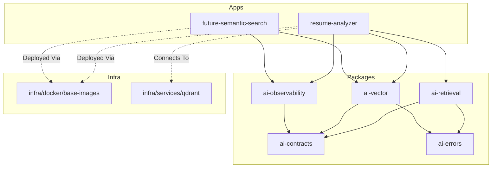

# Dependency DAG

```mermaid
graph TD
    subgraph Apps
        A[resume-analyzer]
        B[future-semantic-search]
    end

    subgraph Packages
        C[ai-retrieval]
        D[ai-vector]
        E[ai-observability]
        F[ai-contracts]
        G[ai-errors]
    end

    subgraph Infra
        H[infra/docker/base-images]
        I[infra/services/qdrant]
    end

    A --> C
    A --> D
    A --> E
    B --> D
    B --> E

    C --> F
    C --> G
    D --> F
    D --> G
    E --> F

    A -.->|Deployed Via| H
    B -.->|Deployed Via| H
    A -.->|Connects To| I
```
